# Fabrication and Electrical Characterization of AlGaN/GaN HEMTs

[](https://www.iitj.ac.in)
[](https://ee.iitj.ac.in)
[]()
[]()
[]()
[]()

> **Author:** Shrey Painuli (M25EET007)  
> **Course Instructor:** Prof. Mahesh Kumar  
> **Department:** Department of Electrical Engineering, Indian Institute of Technology (IIT) Jodhpur  

---

## ⚡ Project Overview

This repository documents the end-to-end cleanroom microfabrication, selective multi-metal wet etching, and sub-femtoamp electrical characterization of **AlGaN/GaN High Electron Mobility Transistors (HEMTs)**. 

The experimental sequence covers substrate cleaving along crystallographic planes, 4-stage ultrasonic surface degreasing, high-vacuum thermal evaporation of an $\text{Al}/\text{Cr}/\text{Au}$ ($180/30/200\text{ nm}$) ohmic stack, photolithographic micro-patterning, selective cyclic wet chemical etching, and rapid thermal annealing (RTA at $850^\circ\text{C}$). Measurements conducted on a **Keithley 6430 Sub-Femtoamp SMU** demonstrate contact activation from an as-deposited insulating open-circuit ($< 0.35\text{ nA}$) to active conduction ($48\ \mu\text{A}$ at $10\text{ V}$) via quantum mechanical field emission.

<p align="center">
  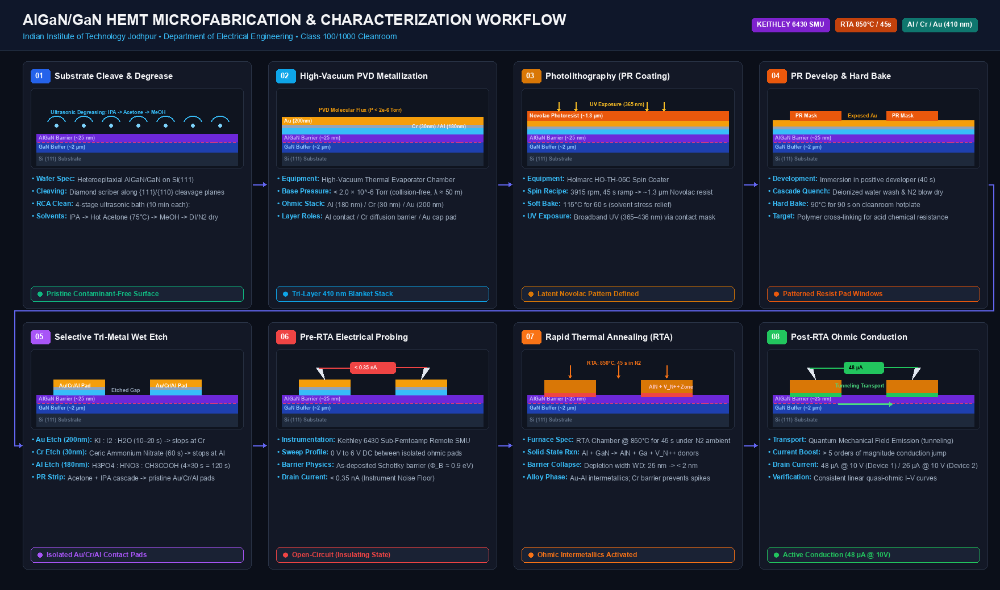
</p>

---

## 🔬 1. Substrate Inspection & Wafer Cleaving

| (a) Side-Profile View | (b) HEMT Wafer Top Reflection | (c) Monocrystalline Si Top Reflection |
| :---: | :---: | :---: |
| 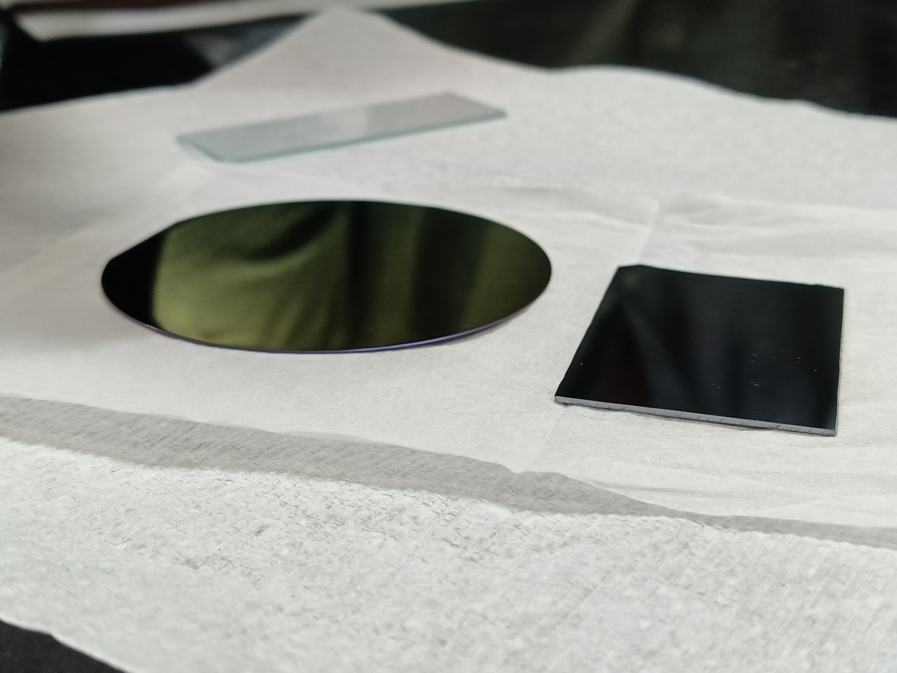 | 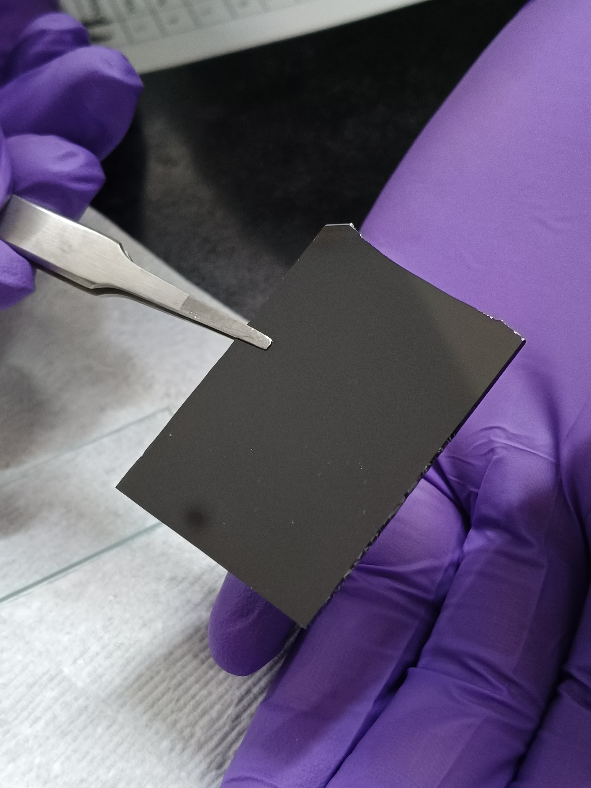 | 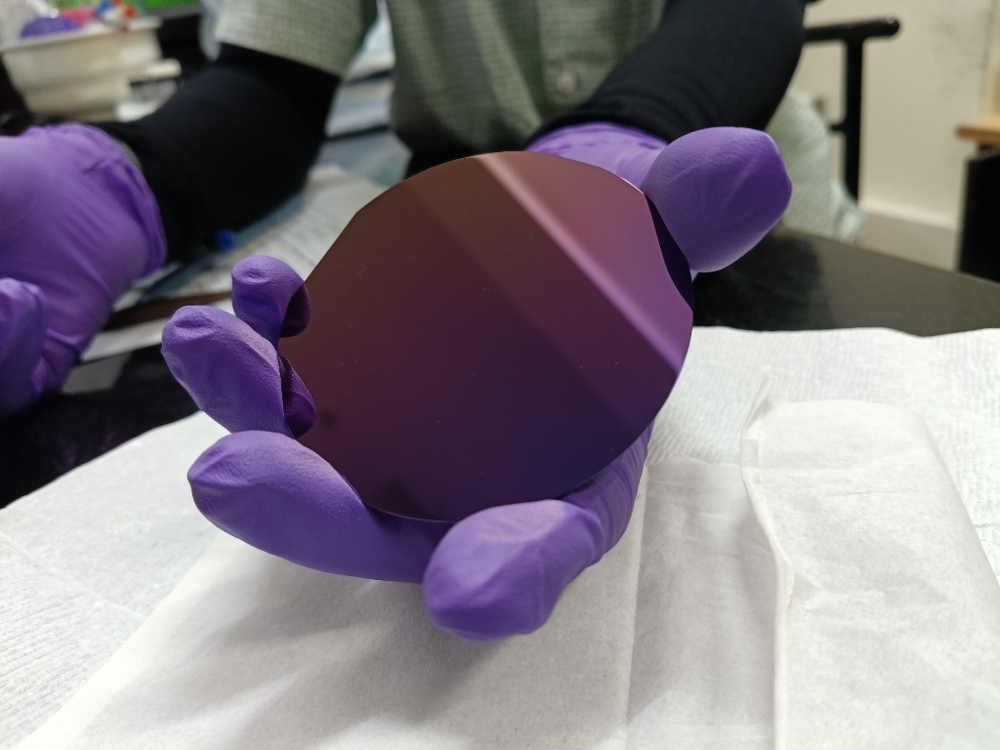 |
| *Identical macroscopic wafer thickness* | *Metallic greyish optical reflectance* | *Distinct purple interference tone* |

### Wafer Slicing & Cleaving
| Wafer Slicing via Diamond Scribing & Cantilever Cleavage | Parameter | Bulk Silicon Dummy | Epitaxial HEMT Wafer |
| :---: | :--- | :--- | :--- |
| 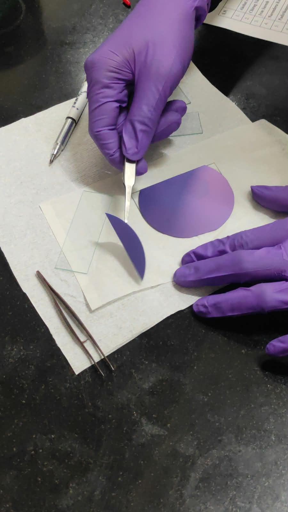 | **Role** | Cleaving / dicing practice | High-value active substrate |
| **Cleavage Plane** | $\{111\} / \{110\}$ natural planes | Heteroepitaxial AlGaN/GaN/Si |
| **Fracture Quality** | Atomically flat mirror facet | Preserved from scratching |
| **Tooling** | Diamond-tip scriber on glass | Cleanroom Teflon tweezers |

---

## 🧪 2. Substrate Degreasing & Ultrasonic Cleaning

| (a) Chemical Solvents | (b) DI Water Cascade Rinse | (c) Inert $\text{N}_2$ Gas Drying |
| :---: | :---: | :---: |
| 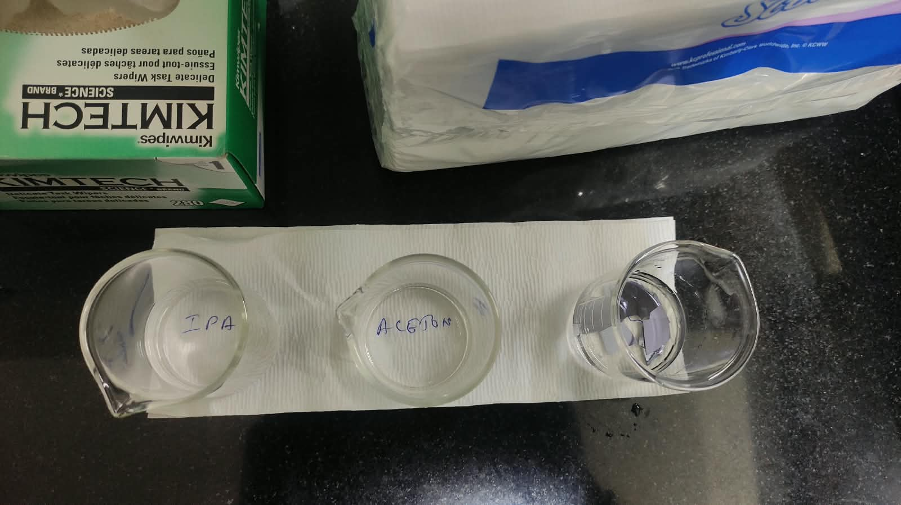 | 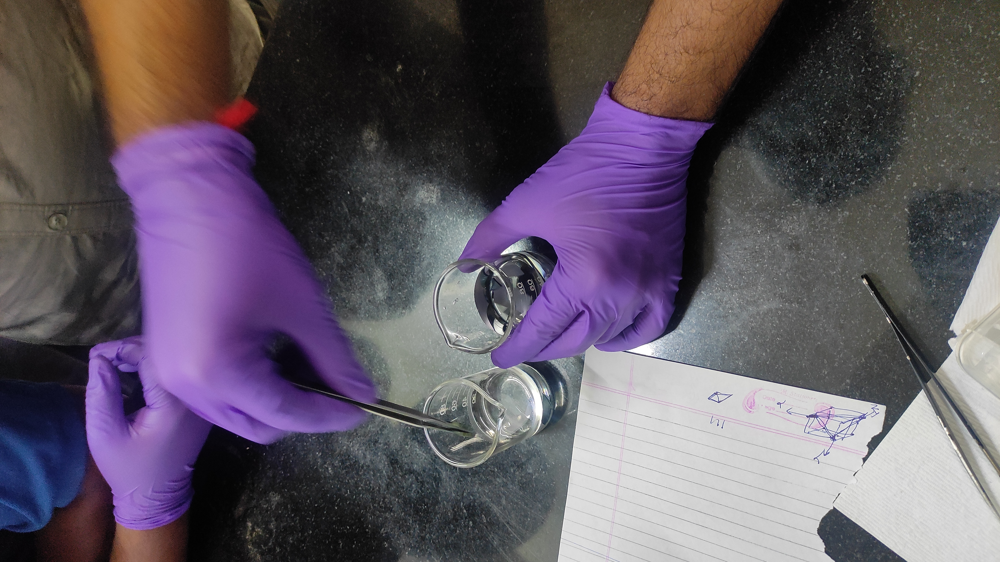 | 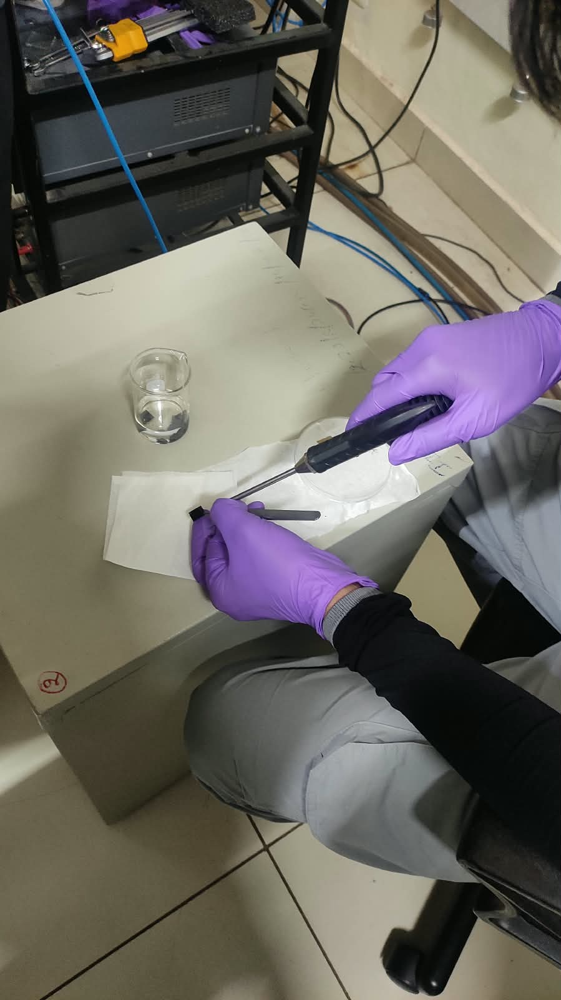 |

| Ultrasonic Bath Processor | Cleanroom Sample Handling | Thermal Evaporation High-Vacuum Box |
| :---: | :---: | :---: |
| 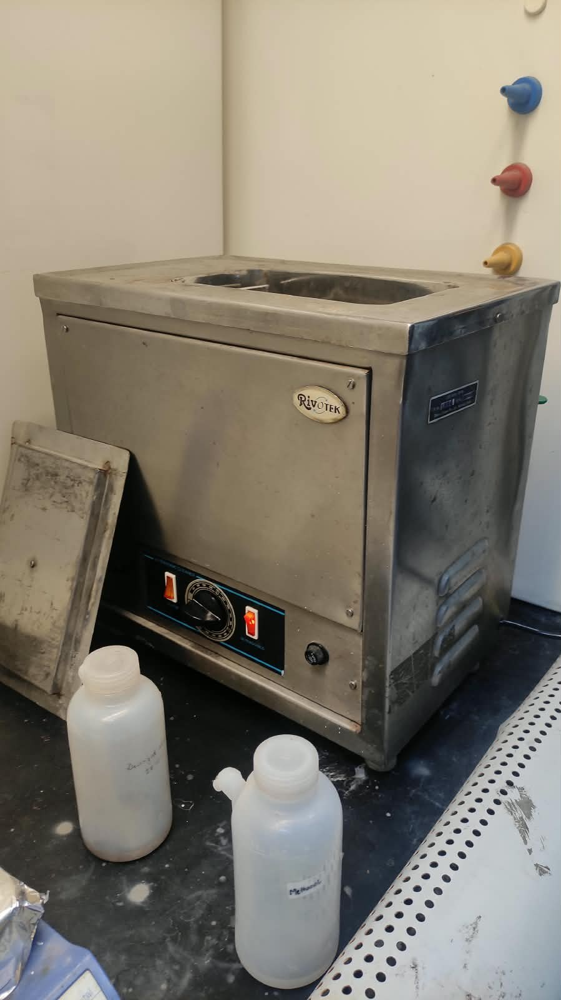 | 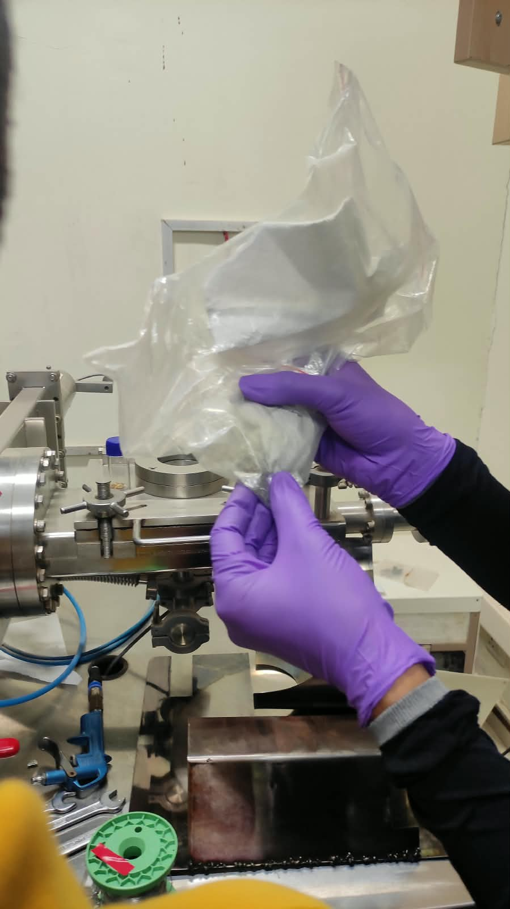 | 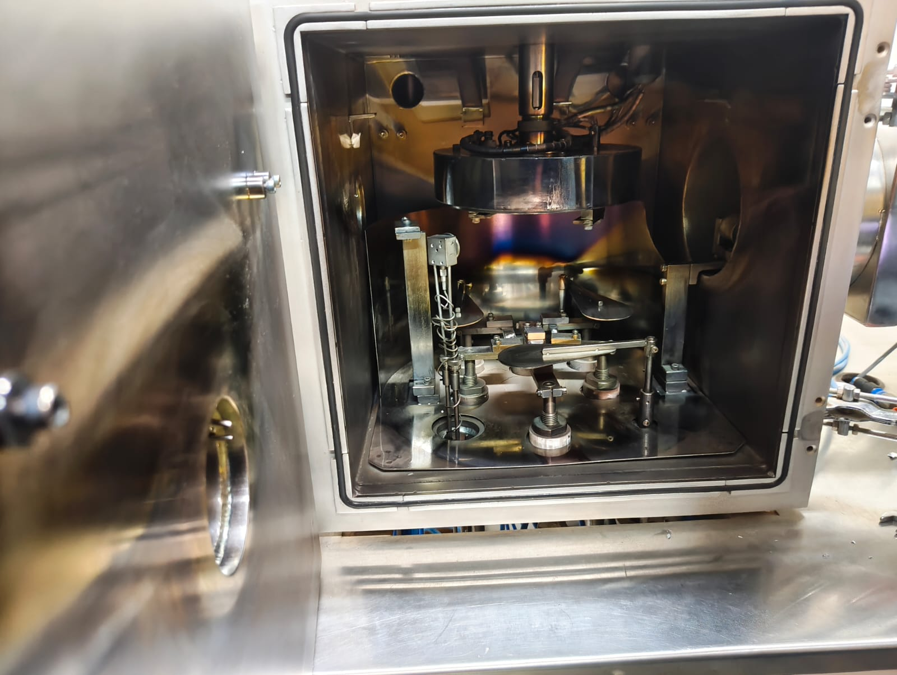 |

### 4-Stage Ultrasonic Solvent Protocol (RCA-Style)
| Stage | Chemical Solvent | Bath Temperature | Duration | Physical & Chemical Rationale |
| :---: | :--- | :---: | :---: | :--- |
| **1** | Isopropanol (IPA) | Ambient ($25^\circ\text{C}$) | 10 min | Gross particulate removal and polar trace stripping |
| **2** | Heated Acetone | $70^\circ\text{C}\text{ – }80^\circ\text{C}$ | 10 min | Dissolution of synthetic oils, waxes, and heavy organic grease |
| **3** | Methanol | Ambient ($25^\circ\text{C}$) | 10 min | Stripping of dried acetone films and lightweight polar residues |
| **4** | DI Water + $\text{N}_2$ | Ambient ($25^\circ\text{C}$) | Cascade + Blow Dry | Complete solvent displacement, ionic rinse, and inert drying |

---

## ⚡ 3. Thermal Evaporation Metallization Stack (PVD)

| Layer | Metal | Thickness | Function | Material Properties |
| :---: | :---: | :---: | :--- | :--- |
| **1 (Bottom)** | **Aluminum (Al)** | $180\text{ nm}$ | Primary Contact Layer | Low work function ($4.28\text{ eV}$); reacts with GaN during RTA to form donor vacancies ($V_\text{N}^{++}$) |
| **2 (Middle)** | **Chromium (Cr)** | $30\text{ nm}$ | Sacrificial Diffusion Barrier | High melting point ($1907^\circ\text{C}$); prevents Au spike diffusion into 2DEG; promotes Al-to-Au adhesion |
| **3 (Top)** | **Gold (Au)** | $200\text{ nm}$ | Low-Resistivity Capping | Oxidation protection, bulk current spreading, and ductile pad for tungsten probe landing |

* **Base Chamber Pressure:** $< 2.0 \times 10^{-6}\text{ Torr}$ (Turbomolecular high-vacuum pump)
* **Mean Free Path ($\lambda$):** $\approx 50\text{ m} \gg 30\text{ cm}$ source-to-substrate distance (collision-free molecular trajectory)

---

## 🎯 4. Photolithography & Resist Patterning

| (a) Holmarc Spin Coater Console | (b) Substrate & Mask Fixture Plate | (c) Contact Hard Shadow / Stencil Masks |
| :---: | :---: | :---: |
| 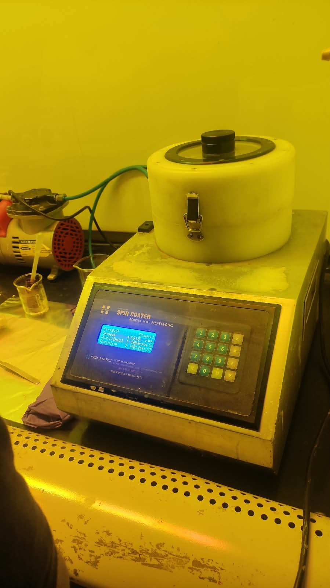 | 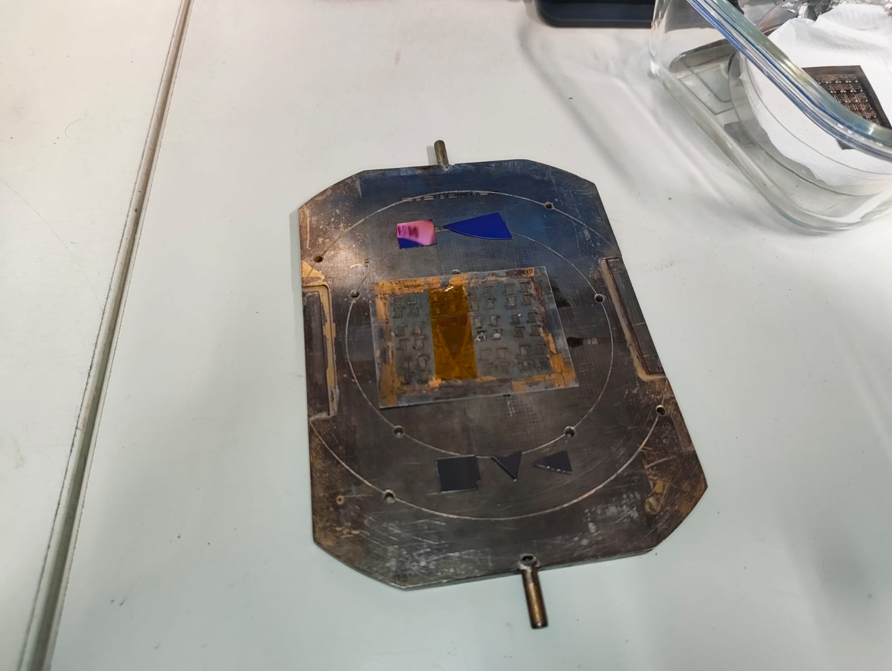 | 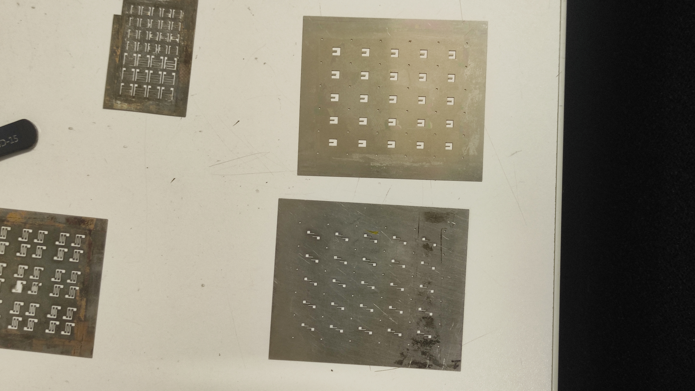 |

### Lithographic Recipe Parameters
| Process Step | Equipment / Reagent | Operating Parameters | Target Specification |
| :--- | :--- | :--- | :--- |
| **Spin Coating** | Holmarc HO-TH-05C | Verified $3915\text{ rpm}$ ($4000\text{ rpm}$ nominal), $45\text{ s}$, $500\text{ rpm/s}$ ramp | $\sim 1.3\ \mu\text{m}$ uniform DNQ-novolac resist |
| **Soft Bake** | Cleanroom Hot Plate | $115^\circ\text{C}$ for $60\text{ s}$ | Solvent evaporation (PGMEA), stress relief |
| **UV Exposure** | Contact Mask Aligner | Broadband UV ($365\text{–}436\text{ nm}$), Chrome mask | Insoluble DNQ $\rightarrow$ soluble indene carboxylic acid |
| **Development** | Positive Developer | Immersion for $\sim 40\text{ s}$ followed by DI water quench | Clean pattern resolution with vertical resist sidewalls |
| **Hard Bake** | Cleanroom Hot Plate | $90^\circ\text{C}$ for $90\text{ s}$ | Polymer cross-linking for chemical acid etch resistance |

---

## 🧪 5. Selective Tri-Metal Wet Etching & Failure Analysis

| (a) Incomplete Etch / Residue | (b) Severe Over-Etch & Undercut | (c) Optimized Selective Etch |
| :---: | :---: | :---: |
| 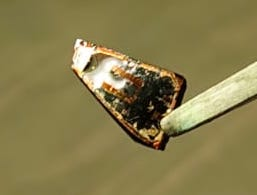 | 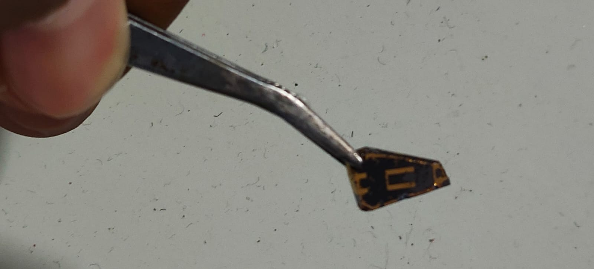 | 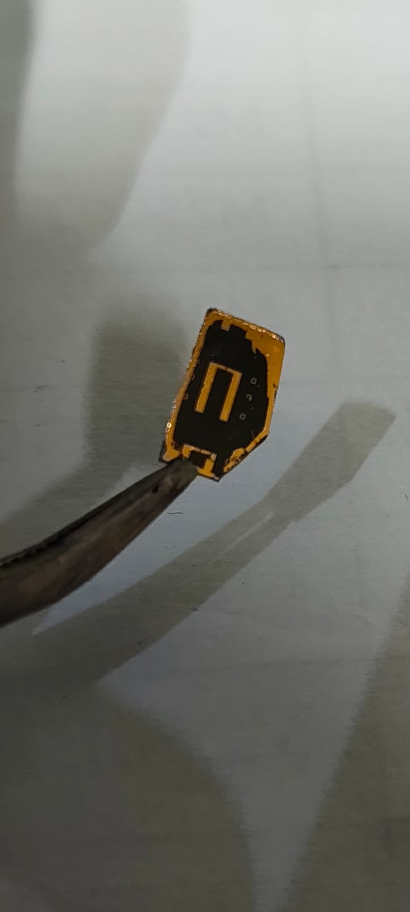 |
| *Milky resist scumming & incomplete metal clearance* | *Etchant lateral attack eroding contact pad structure* | *Pristine, sharply delineated $\text{Au}/\text{Cr}/\text{Al}$ contact pads* |

### Orthogonal Tri-Metal Wet Etch Chemistry
| Step | Metal Layer | Chemical Reagents | Duration | Governing Chemical Reaction Mechanism |
| :---: | :---: | :--- | :---: | :--- |
| **1** | **Au** ($200\text{ nm}$) | $\text{KI} : \text{I}_2 : \text{H}_2\text{O}$ | $10\text{ – }20\text{ s}$ | $2\text{Au} + \text{I}_3^- + \text{I}^- \longrightarrow 2[\text{AuI}_2]^-$ *(stops selectively at Cr)* |
| **2** | **Cr** ($30\text{ nm}$) | $(\text{NH}_4)_2\text{Ce}(\text{NO}_3)_6\text{ / }\text{HClO}_4$ | $50\text{ – }70\text{ s}$ | $\text{Ce}^{4+} + \text{Cr} \longrightarrow \text{Ce}^{3+} + \text{Cr}^{6+}$ *(stops selectively at Al)* |
| **3** | **Al** ($180\text{ nm}$) | $\text{H}_3\text{PO}_4 : \text{HNO}_3 : \text{CH}_3\text{COOH} : \text{H}_2\text{O}$ | $4 \times 30\text{ s}$ ($120\text{ s}$) | $\text{Al} + \text{HNO}_3 \rightarrow \text{Al}_2\text{O}_3$; $\text{Al}_2\text{O}_3 + 6\text{H}_3\text{PO}_4 \rightarrow 2\text{Al}(\text{H}_2\text{PO}_4)_3$ |
| **4** | **PR Strip** | Acetone $\rightarrow$ IPA $\rightarrow$ DI $\rightarrow \text{N}_2$ | Complete | Strips protective resist mask, exposing intact metallic contacts |

---

## 📊 6. Electrical Characterization (Pre-RTA vs. Post-RTA)

### Instrumentation Setup & Pre-RTA Open-Circuit State
| (a) Probe Station Contacting Pads | (b) Pre-RTA KickStart Sweep ($0\text{ to }6\text{ V}$) | (c) Pre-RTA Secondary Sweep ($0\text{ to }5\text{ V}$) |
| :---: | :---: | :---: |
| 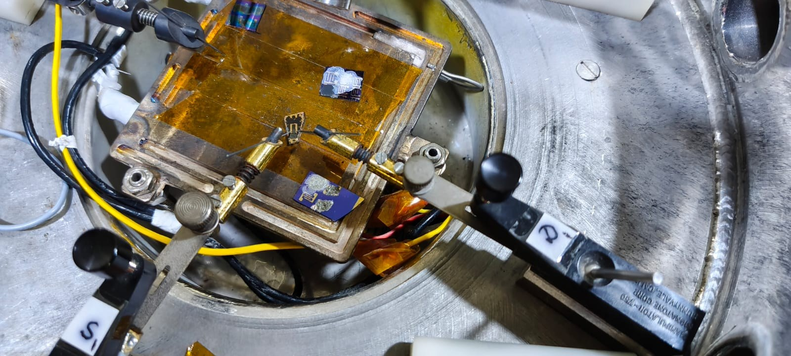 | 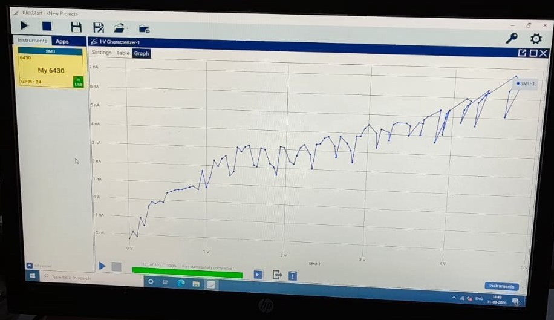 | 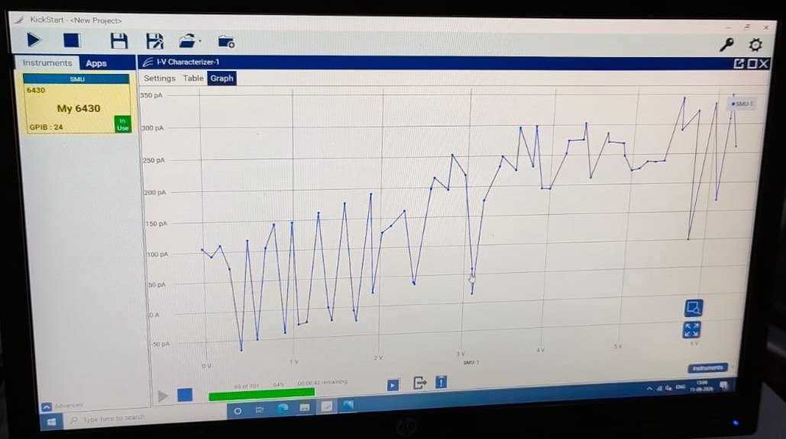 |
| *Tungsten needle probes landed on pads* | *Current flat along noise floor ($-50\text{ to }+350\text{ pA}$)* | *Sub-nA baseline confirms zero carrier transport* |

### Post-RTA Contact Activation ($850^\circ\text{C}$, $45\text{ s}$)
| (a) Device 1 Post-RTA $I$–$V$ Characteristic | (b) Device 2 Post-RTA $I$–$V$ Characteristic |
| :---: | :---: |
| 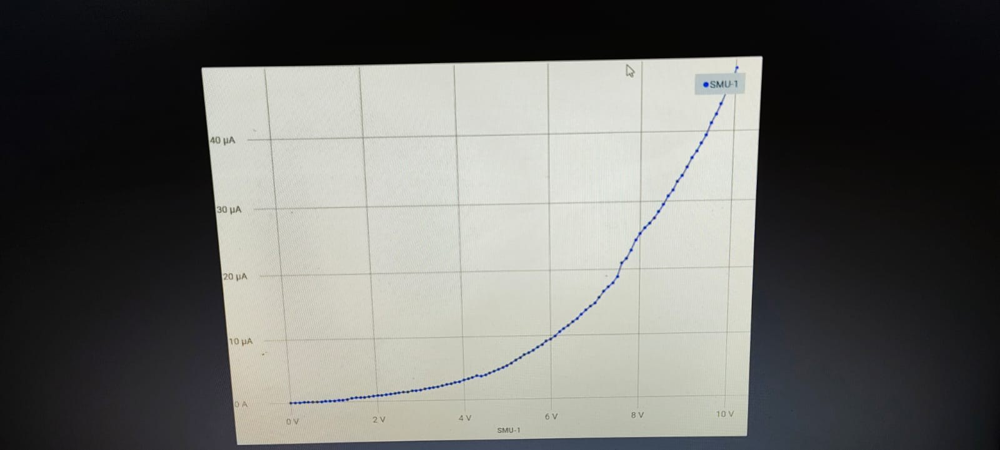 | 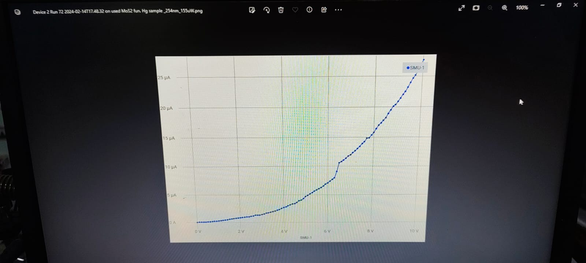 |
| *Robust ohmic activation reaching **$48\ \mu\text{A}$ at $10\text{ V}$*** | *Consistent quasi-ohmic conduction reaching **$26\ \mu\text{A}$ at $10\text{ V}$*** |

### Quantitative Performance Comparison
| Parameter / Metric | Pre-RTA (As-Deposited State) | Post-RTA ($850^\circ\text{C}$, $45\text{ s}$ Annealed State) | Change / Significance |
| :--- | :--- | :--- | :--- |
| **Metallurgical Phase** | Unreacted $\text{Al}/\text{Cr}/\text{Au}$ discrete thin films | $\text{AlN} + \text{dense } V_\text{N}\text{ donor vacancies} + \text{Au-Al}$ phases | Solid-state reaction completed |
| **Conduction State** | Open-circuit / insulating blocking barrier | Active quasi-ohmic / channel conduction | Ohmic contact formed |
| **Drain Current @ 5 V** | $< 5\text{ nA}$ (instrument noise floor) | $\sim 18\ \mu\text{A}$ (Device 1) / $\sim 10\ \mu\text{A}$ (Device 2) | $> 3\times 10^3$ current increase |
| **Drain Current @ 10 V**| Non-conductive ($\sim 0\ \mu\text{A}$) | **$48\ \mu\text{A}$ (Device 1) / $26\ \mu\text{A}$ (Device 2)** | **$> 5$ orders of magnitude jump** |
| **Transport Mechanism**| Thermionic emission blocked by $\Phi_\text{B} \approx 0.8\text{–}1.0\text{ eV}$ | Field Emission (quantum tunneling) via thin $W_\text{D} < 2\text{ nm}$ | Low-resistance carrier injection into 2DEG |

---

## ⚛️ 7. Contact Metallurgy Physics Summary

```
As-Deposited (Blocking Schottky):
  [ Au (200 nm) ] / [ Cr (30 nm) ] / [ Al (180 nm) ] ──||── [ AlGaN Barrier (~25 nm) ] ── [ 2DEG Channel ]
  (Wide barrier WD ~ 25 nm blocks quantum mechanical tunneling; J_FE ≈ 0)

Post-RTA at 850°C (Field Emission Tunneling):
  [ Au-Al Intermetallics ] / [ Cr Barrier ] / [ AlN Interfacial Layer + Dense V_N++ (ND > 10^19 cm^-3) ]
                                      │
                         (Depletion width collapses: WD < 2 nm)
                                      ▼
           [ Quantum Mechanical Fowler-Nordheim Tunneling Directly into 2DEG ]
```

1. **Exothermic Solid-State Reaction:** $\text{Al} + \text{GaN} \longrightarrow \text{AlN} + \text{Ga} + V_\text{N}^{++}$ ($\Delta H_f = -318\text{ kJ/mol}$ for AlN vs. $-110\text{ kJ/mol}$ for GaN).
2. **Degenerate $n^{++}$ Layer:** High concentration of nitrogen vacancies ($V_\text{N}^{++}$) acts as shallow donors, creating an interfacial layer where $N_\text{D} > 10^{19}\text{ cm}^{-3}$.
3. **Barrier Width Collapse:** Depletion width scales as $W_\text{D} = \sqrt{\frac{2\varepsilon_s(\Phi_\text{B} - V)}{q N_\text{D}}}$, collapsing from $\sim 25\text{ nm}$ down to $< 2\text{ nm}$.
4. **Ohmic Transport:** Thin barrier activates quantum mechanical **Field Emission (tunneling)**, delivering low contact resistance to the high-mobility 2DEG channel.
